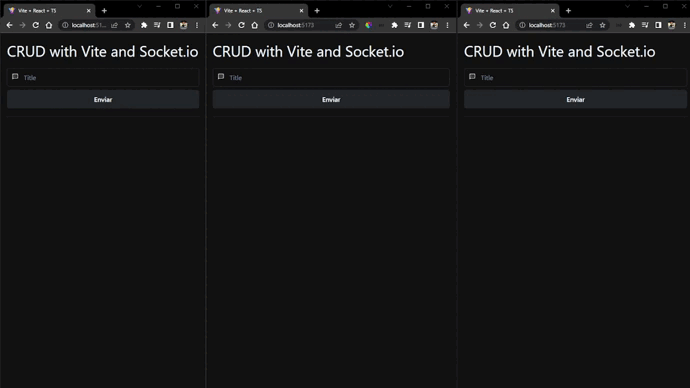

# CRUD on real time



> ⚠️ The backend is needed to reproduce the project. Clone it [here](https://github.com/KollerZx/crud-websockets)

## 👷 Motivation
Create a real-time list to help others developers who need to implement in their projects web socket. Other implementation is on [mobile](https://github.com/LeandroGCruzP/crud-websockets-client-mobile)

## 🔧 Tools
Tools | Version
----- | --------
[Vite](https://vitejs.dev/guide/) | 3.0.0
[React](https://pt-br.reactjs.org/docs/getting-started.html) | 18.2.0
[Socket IO Client](https://socket.io/docs/v4/client-api/) | 4.5.1
[Chakra UI](https://chakra-ui.com/getting-started) | 2.2.6
Typescript | 4.6.4

## 👥 Clone this repository
First, clone this repository with HTTPS
```bash
git clone https://github.com/LeandroGCruzP/crud-websockets-client-web.git
```

or with SSH

```bash
git clone git@github.com:LeandroGCruzP/crud-websockets-client-web.git
```

After, install dependencies of the project

```bash
cd crud-websockets-client-web
```

```bash
yarn
```

To start the project execute
```bash
yarn dev
```

### 😀 For more projects see my [Github](https://github.com/leandrogcruzp) or contact me on on [Linkedin](https://www.linkedin.com/in/leandrogcruzp/) or [Instagram](https://www.instagram.com/lea_gcruz/)
